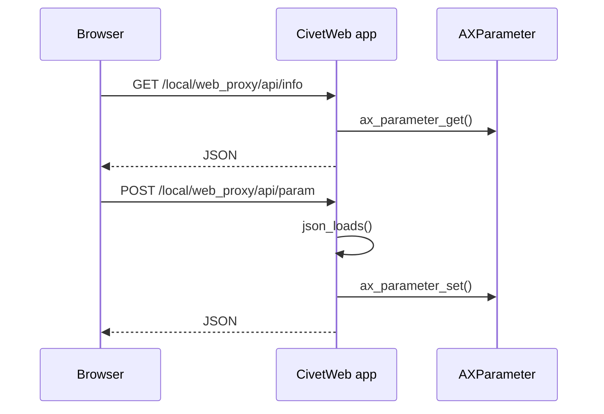

# Web Proxy

This example runs a CivetWeb HTTP server inside the ACAP application and exposes a small JSON API for AXParameter values.

## Endpoints

| Method | Path | Meaning |
| --- | --- | --- |
| `GET` | `/` | Serve `html/index.html` |
| `GET` | `/local/web_proxy/api/info` | Read `MulticastAddress` and `MulticastPort` |
| `POST` | `/local/web_proxy/api/param` | Update `MulticastAddress` and `MulticastPort` |

## Code Flow



## Starting The Server

```c
const char* opts[] = {
    "listening_ports", PORT,
    "request_timeout_ms", "10000",
    "error_log_file", "error.log",
    0
};

struct mg_context* ctx = mg_start(&cb, NULL, opts);
```

## Registering Handlers

```c
mg_set_request_handler(ctx, "/", RootHandler, NULL);
mg_set_request_handler(ctx, "/local/web_proxy/api/info", InfoHandler, NULL);
mg_set_request_handler(ctx, "/local/web_proxy/api/param", ParamHandler, NULL);
```

Each handler returns `1` when it has handled the request.

## Build

```sh
docker build --tag web-proxy --build-arg ARCH=aarch64 .
docker cp $(docker create web-proxy):/opt/app ./build
```

## Classroom Exercises

1. Add an endpoint that returns the application version.
2. Validate the JSON body before calling `ax_parameter_set()`.
3. Compare the request path with the FastCGI example.
